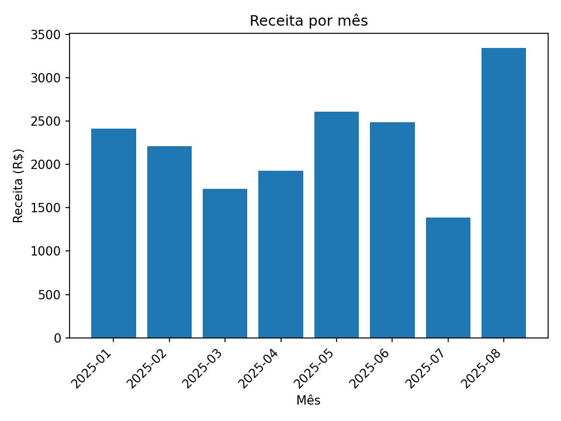

# 🐍📊 Analisador de Dados CSV (Python + Google Colab)

Projeto rápido de portfólio desenvolvido por **Luana Ferreira de Sousa (Lua)**.  
Feito inteiramente no **Google Colab**, utilizando **Python, Pandas e Matplotlib**. 🚀  

🔗 GitHub:  

---

## ▶️ Acesse no Google Colab

*(Clique no botão acima para abrir o notebook direto no Google Colab)*

---

## ✨ O que o projeto faz
- Lê dados de vendas a partir de um arquivo CSV (ou gera exemplo automático).
- Cria coluna de **receita** (`quantidade × preco_unitario`).
- Calcula métricas principais:
  - Total de registros
  - Itens vendidos
  - Receita total
  - Ticket médio por venda
- Mostra **Top 5 produtos por receita**.
- Agrega receita por mês.
- Gera **um gráfico de barras** com receita mensal.
- Exporta um **resumo em texto** com todas as métricas.

---

## 📂 Project Files
- `Projeto_Analise_CSV_Colab.ipynb` → notebook do Google Colab com o código  
- `grafico_receita_por_mes.png` → gráfico gerado com receita mensal  
- `resumo_metricas.txt` → resumo das métricas calculadas  

---

## 📊 Exemplo de saída
Gráfico gerado no projeto:  

---

## 💡 Objetivo
Este projeto foi criado para compor meu portfólio em **Data Analysis com Python**.  
Ele mostra na prática como carregar dados, gerar métricas e criar visualizações simples.  

---
✍️ Desenvolvido por [Luana Ferreira de Sousa (Lua)](https://github.com/lua008ferreira)
